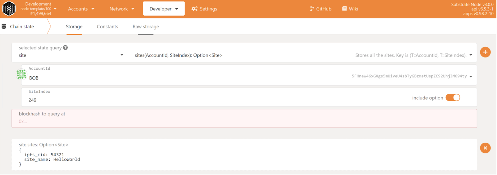

## Test guide for the site-pallet features

First, follow the [Rust Setup](./rust-setup.md).

Then run the following command to git clone the node source code.

```bash
git clone https://github.com/YibanChen/yc-node/tree/site-m2
```

Next you can run the following command to run the unit tests.

```bash
cd yc-node && cargo test --release
```

Next you can run the following command to build and run the node.

```bash
cargo run --release -- --tmp --dev --ws-external --unsafe-ws-external --rpc-cors=all
```

## Interacting on Polkadot.js.org

---

You can access your local running node here: [Polkadot.js Local Node](https://polkadot.js.org/apps/?rpc=ws%3A%2F%2F127.0.0.1%3A9944)

### STEP 0

> Before we begin, there are some types that need to be added to the polkadot.js app. You can enter these types under `Settings -> Developer`

```
{
  "ClassId": "u32",
  "ClassIdOf": "ClassId",
  "TokenId": "u64",
  "TokenIdOf": "TokenId",
  "TokenInfoOf": {
    "metadata": "CID",
    "owner": "AccountId",
    "data": "TokenData"
  },
  "SiteIndex": "u32",
  "Site": {
    "ipfs_cid": "Text",
    "site_name": "Text"
  },
  "ClassInfoOf": {
    "metadata": "string",
    "totalIssuance": "string",
    "owner": "string",
    "data": "string"
  },
  "Note": "Text",
  "NoteIndex": "u32"
}
```

### STEP 1 - Look up the next SiteID

Go to `Developer -> Extrinsics` tab. Select Bob and the nextSiteId method. This next site ID will be the Index of the site that is about to be created.

<p align="center">
  
</p>

### STEP 2 - Create a Site

Go to `Developer -> Extrinsics` tab. Here you can select `Bob` as your selected account
Select the `site` module and the `create` method as shown below. Enter a IPFS hash or a string of text into the ipfs_cid field as well as siteName. After entering the data, submit the transaction.

<p align="center">
  
</p>

To read a Site，select the `site` module and the `sites(AccountId,SiteIndex)` method, enter the SiteIndex looked up in Step1.

<p align="center">
  
</p>

### STEP 3 - Modify a Site

Select the `site` module and the `modify` method as shown below. Enter siteID, siteName and ipfsCid (which is the new id). After entering the data, submit the transaction.

<p align="center">
  
</p>

Read the site by entering the SiteIndex, ipfs_cid shows the modified results now.

<p align="center">
  
</p>

### STEP 4 - Set a Price & List a site for sales

Select the `site` module and the `listing` method as shown below. Enter siteID and newPrice. After entering the data, submit the transaction.

<p align="center">
  
</p>

### STEP 5 - Buy a Site

Using account `ALICE`, select the `site` module and the `buy` method as shown below. Using owner account `BOB`, enter siteID and maxPrice. maxPrice should be equal or greater than the site price, in order to have a successful transaction. After entering the data, submit the transaction.

<p align="center">
  
</p>
The site is in account `ALICE` now.
<p align="center">
  
</p>

### STEP 6 - Transfer a Site

Using account `ALICE`, select the `site` module and the `transfer` method as shown below. Transfer site to account `BOB`, Enter siteID. After entering the data, submit the transaction.

<p align="center">
  
</p>
The site is now in account `BOB`.
<p align="center">
  
</p>

### STEP 7 - Burn a Site

Using account `BOB`, select the `site` module and the `burn` method as shown below. Enter siteID. After entering the data, submit the transaction.

<p align="center">
  
</p>
To read the site by entering the SiteID, the results should be < none > now.
<p align="center">
  
</p>
